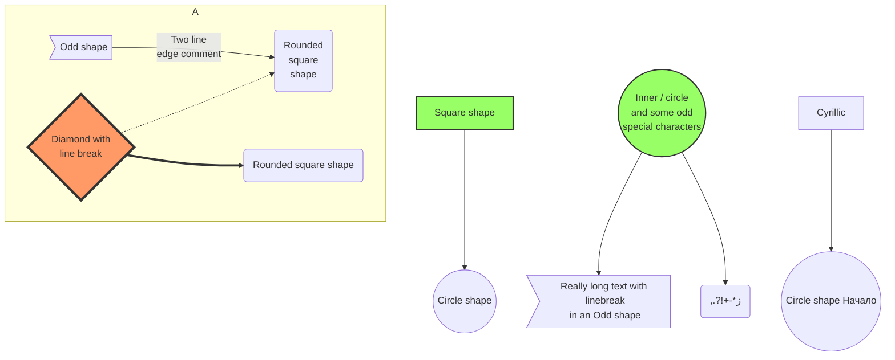

[typography](https://ui.nuxt.com/getting-started/typography){card}

## Prose Component

## 見出し

```md
## 見出し
```

### 小見出し

```md
### 小見出し
```

#### 補足見出し

```md
#### 補足見出し
```

H2, H3 は目次に自動的に表示

### Paragraph

吾輩は猫である。名前はまだ無い。  
どこで生れたかとんと見当がつかぬ。何でも薄暗いじめじめした所でニャーニャー泣いていた事だけは記憶している。

```md
吾輩は猫である。名前はまだ無い。
どこで生れたかとんと見当がつかぬ。何でも薄暗いじめじめした所でニャーニャー泣いていた事だけは記憶している。
```

### Link

[吾輩は猫である](https://ja.wikipedia.org/wiki/吾輩は猫である)

```md
[吾輩は猫である](https://ja.wikipedia.org/wiki/吾輩は猫である)
```

### Blockquote

> 吾輩は猫である。名前はまだ無い。  
> どこで生れたかとんと見当がつかぬ。
>
> > 何でも薄暗いじめじめした所でニャーニャー泣いていた事だけは記憶している。

```md
> 吾輩は猫である。名前はまだ無い。
>
> > 何でも薄暗いじめじめした所でニャーニャー泣いていた事だけは記憶している。
```

### Strong

吾輩は**猫**である。名前はまだ無い。

```md
吾輩は**猫**である。名前はまだ無い。
```

### Emphasis

吾輩は*猫*である。名前はまだ無い。

```md
吾輩は*猫*である。名前はまだ無い。
```

### Unordered List

- 吾輩は猫である
- 名前はまだ無い
  - どこで生れたかとんと見当がつかぬ
  - 何でも薄暗いじめじめした所で
  - ニャーニャー泣いていた事だけは
- 記憶している

```md
- 吾輩は猫である
- 名前はまだ無い
  - どこで生れたかとんと見当がつかぬ
  - 何でも薄暗いじめじめした所で
  - ニャーニャー泣いていた事だけは
- 記憶している
```

### Ordered List

1. 吾輩は猫である
2. 名前はまだ無い
   1. どこで生れたかとんと見当がつかぬ
   2. 何でも薄暗いじめじめした所で
   3. ニャーニャー泣いていた事だけは
3. 記憶している

```md
1. 吾輩は猫である
2. 名前はまだ無い
   1. どこで生れたかとんと見当がつかぬ
   2. 何でも薄暗いじめじめした所で
   3. ニャーニャー泣いていた事だけは
3. 記憶している
```

### Check List

- [x] 吾輩は猫である
- [ ] 名前はまだ無い

```md
- [x] 吾輩は猫である
- [ ] 名前はまだ無い
```

### Tables

| Header A | Header B | Header C |
| -------- | -------- | -------- |
| Cell A1  | Cell B1  | Cell C1  |
| Cell A2  | Cell B2  | Cell C2  |

```md
| Header A | Header B | Header C |
| -------- | -------- | -------- |
| Cell A1  | Cell B1  | Cell C1  |
| Cell A2  | Cell B2  | Cell C2  |
```

### Image


```md

```

### Inline Code

`console.log("吾輩は猫である")`{lang="js"}
`console.log("名前はまだ無い")`{color="error"}
`console.log("どこで生れたかとんと見当がつかぬ")`{color="primary"}
`console.log("何でも薄暗いじめじめした所で")`{color="secondary"}
`console.log("ニャーニャー泣いていた事だけは")`{color="success"}
`console.log("記憶している")`{color="warning"}

```md
`console.log("吾輩は猫である")`{lang="js"}
`console.log("名前はまだ無い")`{color="error"}
`console.log("何でも薄暗いじめじめした所で")`{color="primary"}
`console.log("ニャーニャー泣いていた事だけは")`{color="secondary"}
`console.log("記憶している")`{color="warning"}
```

### Code Block

```json [wagahai.json]{3}
{
  "type": "cat",
  "name": null,
  "born": "i dont know"
}
```

````md
```json [wagahai.json]{3}
{
  "type": "cat",
  "name": null,
  "born": "i dont know"
}
```
````

### Footnotes

吾輩は猫である[^1]
[^1]: 名前はまだ無い。

```md
吾輩は猫である[^1]
[^1]: 名前はまだ無い。
```

### Emoji

吾輩は:cat:である

```md
吾輩は:cat:である
```

## Vue Component

### Accordion

::accordion

    ::accordion-item{label="吾輩は猫である。名前はまだ無い。" :icon="i-lucide-circle-help"}
    どこで生れたかとんと見当がつかぬ。何でも薄暗いじめじめした所でニャーニャー泣いていた事だけは記憶している。
    ::

    ::accordion-item{label="吾輩はここで始めて人間というものを見た。" icon="i-lucide-circle-help"}
    しかもあとで聞くとそれは書生という人間中で一番獰悪な種族であったそうだ。
    ::

::

```mdc
::accordion

  ::accordion-item{label="吾輩は猫である。名前はまだ無い。" :icon="i-lucide-circle-help"}
  どこで生れたかとんと見当がつかぬ。何でも薄暗いじめじめした所でニャーニャー泣いていた事だけは記憶している。
  ::

  ::accordion-item{label="吾輩はここで始めて人間というものを見た。" icon="i-lucide-circle-help"}
  しかもあとで聞くとそれは書生という人間中で一番獰悪な種族であったそうだ。
  ::

::
```

可読性の為にスペースでインデントしています。

### Badge

:badge[v3.0.0]

```mdc
:badge[v3.0.0]
```

## 独自実装コンポーネント

### Mermaid


````mmd

````

### リンクカード

[吾輩は猫である](https://ja.wikipedia.org/wiki/吾輩は猫である){card}

```mdc
[吾輩は猫である](https://ja.wikipedia.org/wiki/吾輩は猫である){card}

または

:link-card{href="https://ja.wikipedia.org/wiki/吾輩は猫である"}
```
